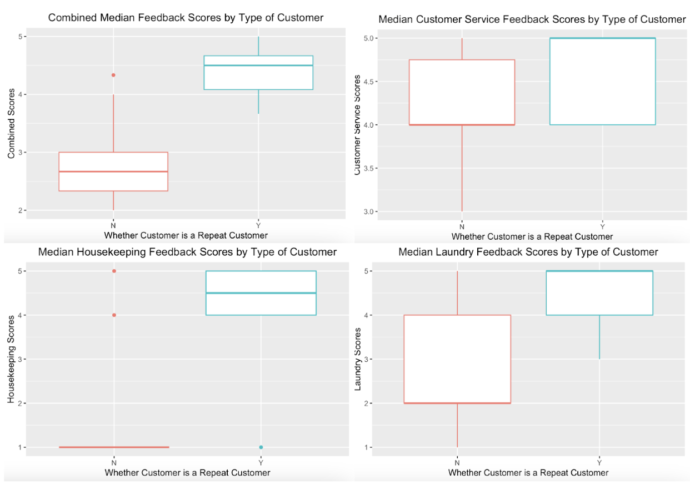
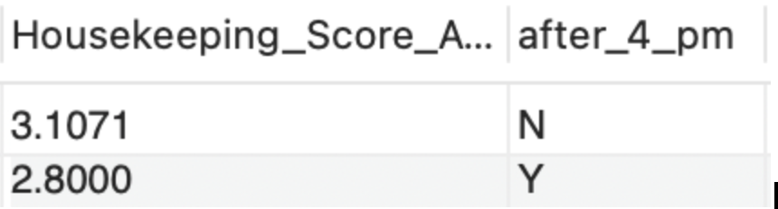

**Background:**  
  - **Wilted Lotus** is a resort-style hotel in Orlando, Florida, known for affordable pricing and proximity to theme parks.  
  - Recent guest complaints regarding room cleanliness have tarnished the hotel’s reputation, impacting revenue and employee morale.  

**Project Goals:**  

  - Develop a relational database to improve **operational efficiency** and address issues impacting room readiness.  
  - Provide management with insights to identify key problem areas and optimize resource allocation.  

**Relational Database Development:**  
  - Centralized data for **7 entities**: guest stays, customer service staff, management staff, rooms, laundry crew, housekeepers, and suppliers.  
  - Designed relationships to ensure transparency and streamline decision-making.
 

## SQL Queries and Insights for Wilted Lotus

### Query 1 - Feedback Scores Based on Season
- **Objective**: Identify seasonal patterns in guest satisfaction scores to improve resource allocation.
- **Findings**:
  - Summer had the lowest average scores for housekeeping and laundry services.
  - Suggests summer-specific hiring to address increased demand during peak travel season.
- **Output**: Average scores for housekeeping, laundry, and customer service by season.
- **SQL Code**:
 
  SELECT 'Fall' AS Season, AVG(hkScore) AS avg_hkScore, AVG(LScore) AS avg_LScore, AVG(servScore) AS avg_servScore
  FROM Guest_stay
  WHERE MONTH(CheckIn) IN (9, 10, 11)
  UNION
  SELECT 'Winter' AS Season, AVG(hkScore), AVG(LScore), AVG(servScore)
  FROM Guest_stay
  WHERE MONTH(CheckIn) IN (12, 1, 2)
  UNION
  SELECT 'Spring', AVG(hkScore), AVG(LScore), AVG(servScore)
  FROM Guest_stay
  WHERE MONTH(CheckIn) IN (3, 4, 5)
  UNION
  SELECT 'Summer', AVG(hkScore), AVG(LScore), AVG(servScore)
  FROM Guest_stay
  WHERE MONTH(CheckIn) IN (6, 7, 8);

**Visualized Feedback Scores in R**

### Query 2- Feedback Scores for Repeat Customers vs Non-repeat

The primary goal for our database is to increase the efficiency of Wilted Lotus and consequently improve guest satisfaction. One way to effectively evaluate overall guest satisfaction is by looking at feedback scores. Ultimately, however, Wilted Lotus would want to see managerial improvements result in not just improved feedback scores but also more satisfied guests returning and staying again. Successful customer retention would incentivize the hotel to continually improve efficiency since that would provide a stable base of customers to earn revenue from.

- **SQL Code**:
  SELECT AVG(hkScore) AS Housekeeping_Score_Avg, 
       AVG(LScore) AS Laundry_Score_Avg, 
       AVG(servScore) AS Customer_Service_Avg, 
       SUM(hkScore + LScore + servScore) / (COUNT(*)*3) AS All_Score_Avg,
       IF(guestID IN(SELECT guestID FROM guest_stay GROUP BY guestID HAVING COUNT(DISTINCT tripID)>1), "Y", "N") AS Repeat_Customer
FROM guest_stay
GROUP BY Repeat_Customer
ORDER BY Repeat_Customer;

###Query 3 - Average Housekeeping Score for Cleanings After 4 PM

Our database can be used to identify potential reasoning behind low housekeeping scores. One hypothesis is that rooms are not cleaned prior to guests checking in. To test this idea, we decided to determine the average housekeeping score for cleaning that occurred after 4 PM, which is right after guests’ check-in time.

Output
The SQL output demonstrates that amongst guests who had their rooms cleaned after 4 PM, there was an average 2.71 housekeeping score. In comparison, there was an average housekeeping score rating of 3.19 amongst guests who had their rooms cleaned before 4 PM. This output suggests that the time when a guest’s room is cleaned has an impact on their housekeeping score.

- **SQL Code**:

SELECT AVG(hkScore) AS Housekeeping_Score_Avg, 
       IF(DayTimeClean IN (SELECT DayTimeClean FROM Cleans WHERE EXTRACT(HOUR FROM Cleans.DayTimeClean) >= 16), "Y", "N") AS after_4_pm
FROM guest_stay
JOIN staysIn ON Guest_stay.tripID = staysIn.tripID
JOIN Cleans ON staysIn.roomNo = Cleans.roomNo
GROUP BY after_4_pm;

### Query 4 - Relationship Between Order Times and Delays in Delivery

To understand the reason behind the late cleaning times, we assessed the relationship between cleaning supply order times and delivery times.

Output
The output shows that orders placed in the morning were coupled with deliveries the next day. Orders not placed in the morning were coupled with deliveries that took two days to arrive. The data indicates that management should always order supplies in the morning to minimize delays.

- **SQL Code**:

SELECT mgrID, 
       orderTime, 
       pickupTime, 
       DATEDIFF(pickupTime, orderTime) AS DaysBeforeArrival,
       IF(orderTime LIKE '% 09:%' OR orderTime LIKE '% 10:%' OR 
          orderTime LIKE '% 11:%', "Y", "N") = "Y" AS MorningOrder 
FROM Orders 
ORDER BY MorningOrder, orderTime ASC;

### Query 5 - Supplier on Delivery Delay
Once the driver picks up the supplies described in the previous query, the driver must then deliver them to the Wilted Lotus.

Output
The output above shows that the supplier with supID 50001, who supplies soap, takes an additional day to deliver the supplies relative to the three other suppliers who deliver the supplies within one day. Wilted Lotus should seek additional data which could explain the reason for the extended delay time.

- **SQL Code**:

SELECT o.supID, 
       o.pickupTime, 
       o.delivTime, 
       DATEDIFF(o.delivTime, o.pickupTime) AS DriverDelay, 
       s.item
FROM Orders o, Supplier s
WHERE o.supID = s.supID
ORDER BY DriverDelay DESC;

**Outcomes:**  
  - Enabled identification of trends contributing to unclean rooms, such as staffing shortages or supply mismanagement.  
  - Improved resource allocation by pinpointing high-impact issues, like increasing housekeeper staff during peak seasons.  
  - Enhanced communication across staff roles by providing a **singular reference system** for customer and supplier information.  

**Business Recommendations:**  
  - Hire seasonal housekeepers during high-demand periods to meet turnover demands.  
  - Focus on ensuring sufficient supply orders are placed in advance to avoid disruptions.  
  - Reduce error in decision-making through actionable insights provided by the database.  

### Welcome to my portfolio!  
This project highlights how a well-designed relational database can solve real-world business problems in the competitive hospitality industry.  
